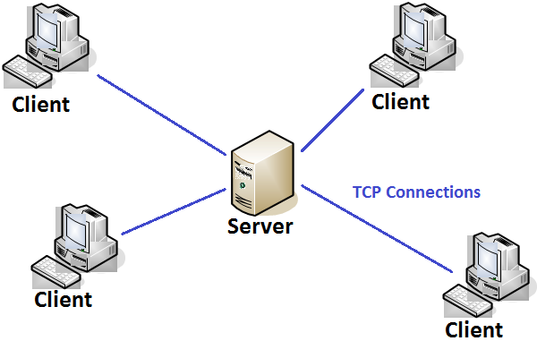
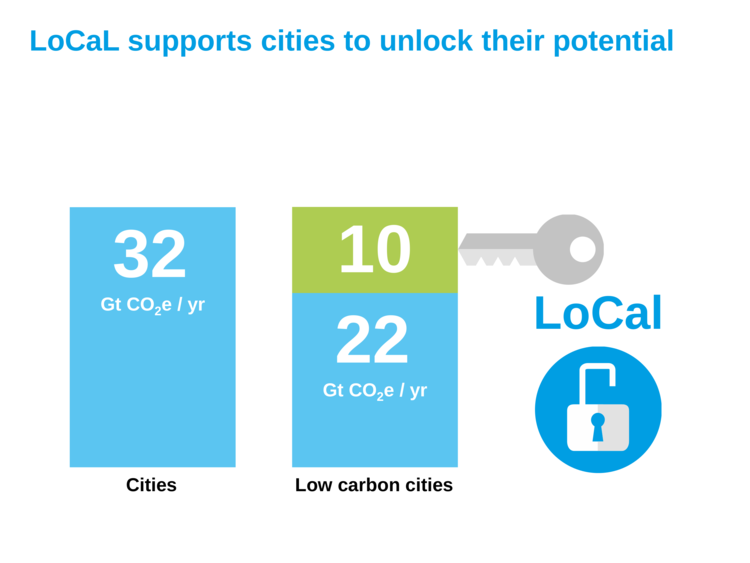
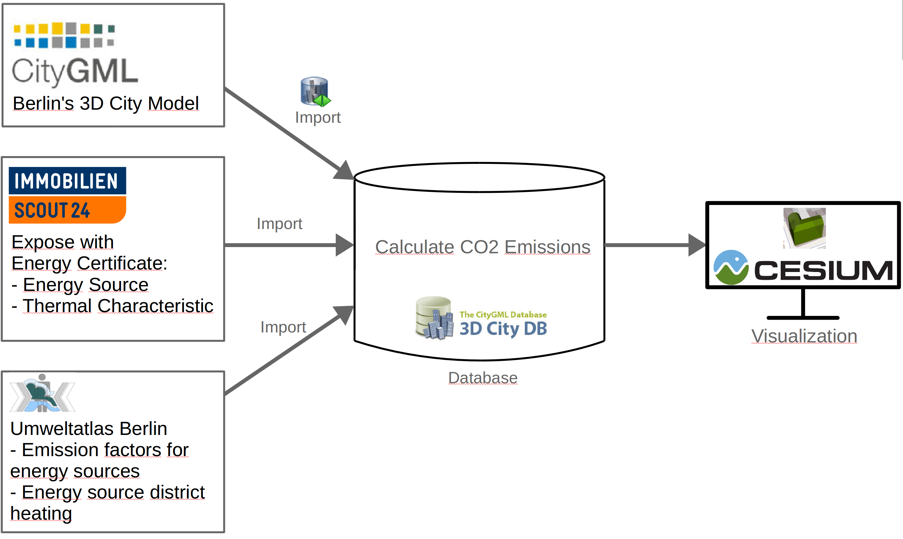
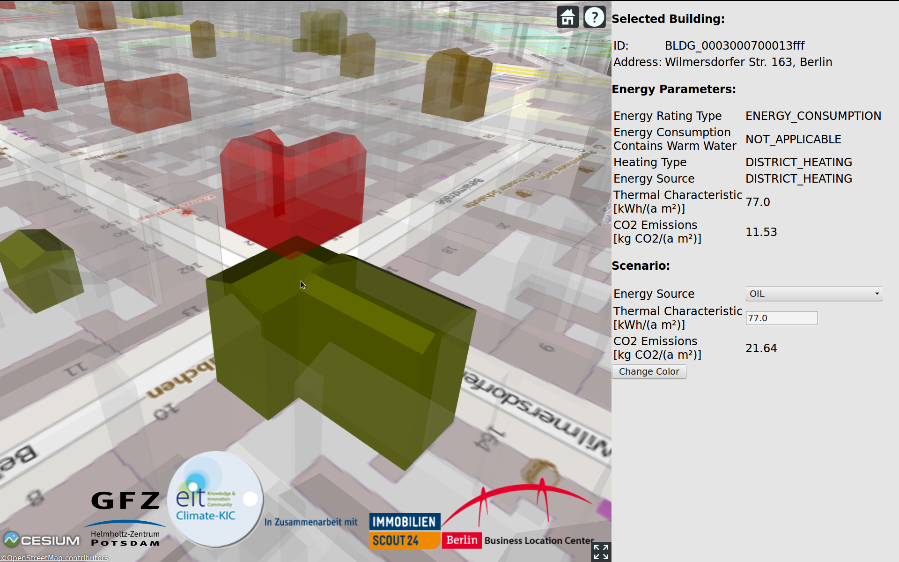
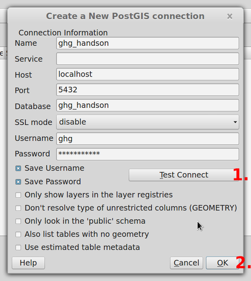
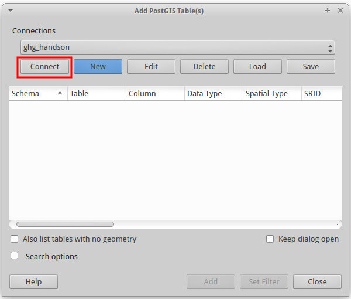
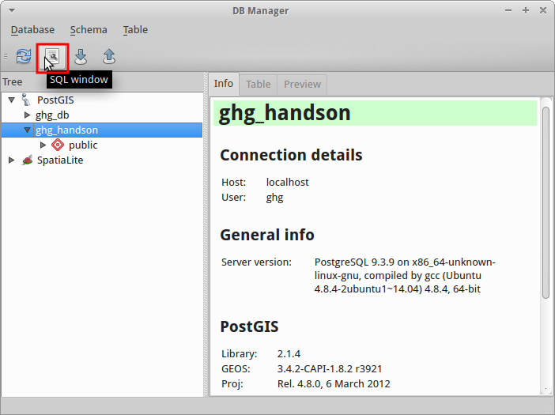

% CityGML \
  Applications, Open Data and Open Source Tools
% Richard Redweik & Stefan Lüdtke
% 22. - 23. November 2015

#
## Agenda

* Thursday: General introduction into tools and workflows

* Friday: Practical hands-on session

#
## CityGML Recap 

* Application independent geospatial information model

* International OGC standard

* Different thematic areas (buildings, water, vegetation, bridges etc.)

* CityGML represents

	* 3D geometrey, 3D topology, semantics, and appearance
	* in 5 discrete scales (levels of detail, LOD)

* **Data model (UML)** and **exchange format** (based on GML3)

#
## CityGML Thematic Modelling


#
## Example: Building Model

* Coherent aggregation of spatial and semantical components

    * (Recursive) composition of building parts
    
    * Thematic surfaces (roof, wall, etc. surfaces) [from LOD2]
    
    * Building installations (stairs, balconies) [from LOD2]
    
    * Openings (doors, windows) [from LOD3]
    
    * Rooms and furniture [from LOD4]

#
## Building Model LOD2 - UML Diagram


#
## However!

CityGML datasets may become very large 

--&gt; Use database to work with!

#
## Need for Database? Some Examples!

* Multiple simultaneous changes to data (concurrency)

* Data changes on a regular basis

* Large data sets where you only need some observations/ variables

* Share huge data set among many people (data consistency in a working group!)

* Rapid queries

* Web interfaces to data, especially dynamic data

#
## Databases

* Data bases are collections of tables (2D with columns and rows)

* Very good for combining information from several tables

* E.g., select all buildings located in Berlin
 
ID   Name 	    Population
---- ----------	--------------
1    Berlin 	       3502000
2    Potsdam	        159456

Table: Table *City*

ID 	    City 	    Height	
----	--------	----------
1	       1	      10.0
2	       1	      22.2
3	       2 	      15.0

Table: Table *Building*

# 
## Used Tools 

* 3D City Database (3DCityDB)

* 3D City Database Importer/Exporter

* pgAdmin

* QGIS

# 
## 3DCityDB - Overview

](./pictures/3DCityDB_System.png)

#
## 3DCityDB - Details

Free 3D geo database

Enables to store, represent, and manage virtual 3D city models

Realized as relational database schema for:

- **PostgreSQL/PostGIS**
- Oracle Spatial

#
## Don't be afraid!

* May appear complex in the beginning (60 tables)
	
* But!
	
	* Tables are strucuted logically

	* You probably do not use all tables

--&gt; 3DCityDB not as complex as it seems!


#
## 3DCityDB - Building Schema

Subset of the building schema


#
## PostgreSQL


* Relational Database Management System (RDBMS)

* **Open Source**

* Strong reputation for **reliability**, **data integrity** and
**correctness**

* Very good documentation

* Runs on Linux, Unix (MacOS, BSD), Windows

* pgAdmin as GUI for administration

#
## SQL 

* **S**tructured **Q**uery **L**anguage
* Language to save, edit and query data in relational data bases
* First version in 1974 (IBM) 
* Became a standard of the American National Standards Institute (ANSI) in 1986
* Revised in 1999: SQL99 or SQL3
* SQL has standards but also some pecularities depending on the database management system
* Used to 'talk' to the database server
* Used as front end for postgresql
* Case sensitive (usually upper case for keywords)

#
## Ways to use SQL

* Console command (psql -h hostaddress -U  db_name)

* GUI (pgadmin)

* Interfaces to programming languages (R, python, Java, etc.)

# 
## SQL Syntax - I

* Create Database
```sql
CREATE TABLE measurements (id BIGINT NOT NULL DEFAULT, date TIMESTAMP WITH TIME ZONE, value DOUBLE PRECISION);
```

* Insert Data
```sql
INSERT INTO mesurements 
VALUES('2014-09-01', 10.456);
```

* Edit Data
```sql
UPDATE measurements 
SET value = value + 1;
```

#
## SQL syntax - II

* Query Data
```sql
SELECT value 
FROM measurements;
```

* Comparison/Filter
```sql
SELECT value 
FROM measurements 
WHERE date > '2013-01-01';
```

* Summary and Computations
```sql
SELECT MAX(value) AS max_val 
FROM measurements 
WHERE date > '2013-01-01'
```

## PostgreSQL


* Includes most SQL:2008 data types, including INTEGER, NUMERIC, BOOLEAN, CHAR, VARCHAR, DATE, INTERVAL, and TIMESTAMP

* Supports storage of binary large objects, including pictures, sounds, or video

* Diverse native programming interfaces (C/C++, Java, .Net, Perl, Python, ... )


## Key features

---------------------------------------------------------------
Limit                              Value
-------------------------  ------------------------------------
Database Size					   Unlimited

Maximum Table Size				   32 TB

Maximum Row Size				   1.6 TB 

Maximum Field Size				   1 GB 

Maximum Rows per Table			   Unlimited

Maximum Columns per Table		   250 - 1600 depending on column types 

Maximum Indexes per Table		   Unlimited 

---------------------------------------------------------------

## Architecture



## SQL 

* **S**tructured **Q**uery **L**anguage
* Language to save, edit and query data in relational data bases
* First version in 1974 (IBM) 
* Became a standard of the American National Standards Institute (ANSI) in 1986
* Revised in 1999: SQL99 or SQL3
* SQL has standards but also some pecularities depending on the database management system
* Used to 'talk' to the database server
* Used as front end for postgresql
* Case sensitive (usually upper case for keywords)

## Ways to use SQL

* Console command (psql -h hostaddress -U  db_name)

* GUI (pgadmin)

* Interfaces to programming languages (R, python, Java, etc.)

## SQL Syntax - I

* Create Database
```sql
CREATE TABLE measurements (id BIGINT NOT NULL DEFAULT, date TIMESTAMP WITH TIME ZONE, value DOUBLE PRECISION);
```

* Insert Data
```sql
INSERT INTO mesurements 
VALUES('2014-09-01', 10.456);
```

* Edit Data
```sql
UPDATE measurements 
SET value = value + 1;
```

## SQL syntax - II

* Query Data
```sql
SELECT value 
FROM measurements;
```

* Comparison/Filter
```sql
SELECT value 
FROM measurements 
WHERE date > '2013-01-01';
```

* Summary and Computations
```sql
SELECT MAX(value) AS max_val 
FROM measurements 
WHERE date > '2013-01-01'
```

#
## PostGIS

* Spatial extension for PostgreSQL

* Support for spatial objects (geometry, geography, raster)

* Spatial predicates (interaction of geometries)

* Spatial operators
	* Measurements (area, distance, length, etc.)
	* Set operations (union, difference, etc.)

* Multi-dimensional spatial indexing

#
## PostGIS - Example

* Select cities with certain area and population
```sql
SELECT name, pop FROM cities 
WHERE pop < 300000  
AND ST_Area(cities.the_geom) < 400000000;
```

* Select houses located in the suburbs
```sql
SELECT houses.*
FROM houses, suburbs
WHERE ST_Intersects(houses.geom, suburbs.geom);
```

## Additional Data Type for Geometry

* The geometry is stored in a extra column, usually termed *geom* or *the_geom*, all based
the following [link](http://postgis.net/docs/manual-2.1/using_postgis_dbmanagement.html)
 
* Uses Well-Known Binary (WKB) and Well-Known Text (WKT) Representations defined by *OGC*

* Example WKB:
	* POINT (10 10)
	* LINESTRING (10 10,20 20,30 40)
	* POLYGON ((10 10, 10 20, 20 20, 20 15, 10 10))
	* MULTIPOINT ((0 0),(1 2))
	* MULTILINESTRING ((0 0,1 1,1 2),(2 3,3 2,5 4))


## PostGIS provides 

* Processing and analytic functions for both vector and raster data (e.g. splicing, dicing, morphing, reclassifying, and unioning)

* Raster map algebra

* Functions for spatial reprojection 

* Support for ESRI shapefile vector data (+ more formats via 3rd-party tools)

* Importing data from many standard formats
	* Raster data (GeoTiff, NetCDF, PNG, JPG, ...)
	* Vector data (KML,GML, GeoJSON, GeoHash and WKT) 

## PostGIS provides (cont.)
	
* Rendering raster data in various standard formats GeoTIFF, PNG, JPG, NetCDF, ...

* Seamless raster/vector functions for extrusion of pixel values by geometric region, running stats by region, clipping rasters by a geometry, and vectorizing rasters

* 3D object support, spatial index, and functions

* Network topology 

## PostGIS as a GIS

* **PostGIS offers *full* GIS functionality ...**
	* reprojection
	* area calculations 
	* intersect, union, merge ... 

* **... among all data-types**
	* all vector types supported (point, line, area ...)
	* raster layers supported as well

* **and standard interfaces for visualization**
	* QGIS, GRASS spatial layers from a Postgres DB out of the box
	* ArcMap is supposed to do so as well

## PostGIS Functions

* '`ST_`' prefix (Convention for spatial type)
* Functions to work with the *geom* column

* Getting the CRS of the table/layer
```sql
SELECT ST_SRID(geom)
FROM catchments;
```

* Re-project geometry into a different CRS 
```sql
UPDATE subbasins 
SET geom = ST_TRANSFORM(geom, 4326);
```

## PostGIS - Example

* Select cities with certain area and population
```sql
SELECT name, pop FROM cities 
WHERE pop < 300000  
AND ST_Area(cities.the_geom) < 400000000;
```

* Select houses located in the suburbs
```sql
SELECT houses.*
FROM houses, suburbs
WHERE ST_Intersects(houses.geom, suburbs.geom);
```


#
## 3D City Database Importer/Exporter

Front-end for 3D city database

Allows importing and exporting of CityGML data into/from 3DCityDB

Allows export in KML and COLLADA for visualization

Offers GUI and CLI

# 
## 3DCityDB-Overview

](./pictures/3DCityDB_System.png)

# 
## QGIS

Previously known as *Quantum GIS*

Open source Geographic Information System (GIS)

Integration of **PostGIS** and GRASS

Runs on Linux, Unix, MacOS, Windows, Android

Supports many vector, raster, and database formats and functionalities

Customizable via plugins (C++, Python)

# 
## 3D City Model Berlin

550.000 buildings on about 890 sqkm

LOD2 building models with facade textures

Can be downloaded and used as part of Berlin's Open Data Initiative

Berlin 3D - [Download Portal](http://www.businesslocationcenter.de/en/downloadportal)

#
## Data modelling

is **fundamental** for efficient 

* storage of data
* data maintenance
* work with data

## Database normalisation

Normalisation is the formalisation of the design process of making a database compliant with the concept of a Normal Form. 

It addresses various ways in which we may look for repeating data values in a table.

There are several levels of the Normal Form, and each level requires that the previous level be satisfied.

The normalization process is based on collecting an exhaustive list of all data items to be maintained in the database and 
starting the design with a few "superset" tables. 

## Normalisation- First Normal Form

For best results, start with a reasonable breakdown of all attributes in different tables

Reduce entities to first normal form (1NF) by removing repeating or multivalued attributes to another, child entity.

Basically, make sure that the data is represented as a (proper) table. 

While key to the relational principles, this is somewhat a motherhood statement. 

## Normalisation- First Normal Form

However, there are six properties of a relational table (the formal name for "table" is "relation"):

1. Entries in columns are single-valued.
2. Entries in columns are of the same kind.
3. Each row is unique.
4. Sequence of columns is insignificant.
5. Sequence of rows is insignificant.
6. Each column has a unique name.

\

The most common sins against the first normal form (1NF) are the lack of a Primary Key and the use of "repeating columns." 

## Normalisation- Second Normal Form

Reduce first normal form entities to second normal form (2NF) by removing attributes that are not dependent on the whole primary key.

The purpose here is to make sure that each column is defined in the correct table. Using the more formal names may make this a little clearer. Make sure each attribute is kept with the entity that it describes. 

## Normalisation- Third Normal Form

Reduce second normal form entities to third normal form (3NF) by removing attributes that depend on other, non-key attributes (other than alternative keys).

This basically means that we shouldn't store any data that can either be derived from other columns or belong in another table

\

\

* for more background and guidance 
[code guru](http://www.codeguru.com/csharp/.net/net_data/article.php/c19615/Introduction-to-Relational-Databases--Part-1-Theoretical-Foundation.htm)

#
## Hands-On 

Create Database

Create 3D City Database

Import City Model

Inspect Database with pgAdmin

Export building data with QGIS

#
## Thursday!

#
## Export building data with QGIS - I

Query:

```sql
WITH
groundSurfaces AS (
	SELECT thematic_surface.* 
	FROM citydb.thematic_surface INNER JOIN citydb.objectclass 
	ON objectclass.id = thematic_surface.objectclass_id 
	WHERE classname='BuildingGroundSurface'
),
surfaceGeometries AS (
	SELECT *
	FROM citydb.surface_geometry INNER JOIN groundSurfaces
	ON groundSurfaces.lod2_multi_surface_id = surface_geometry.parent_id
	WHERE geometry IS NOT NULL
),
heights AS (
	SELECT measured_height, surfaceGeometries.*
	FROM citydb.building INNER JOIN surfaceGeometries
	ON building.id = surfaceGeometries.building_id
)
SELECT row_number() OVER() As id, building_id, 
measured_height, ST_Force2d(geometry) AS footprint FROM heights;
```

#
## Export building data with QGIS - II


#
## Export building data with QGIS - III


#
## Eddy Footprint with 3D City Model

Footprint provided by Gerardo Fratini!

#
## Outlook LoCaL

Low Carbon City Lab



#
## Outlook LoCaL
Architecture


#
## Outlook LoCaL
Information View


#
## Questions?

Focus for tomorrow?

#
## Friday!

#
## Hands-On 

Start Virtual Machine

Create Database

Create 3D City Database

Import City Model

Inspect Database with pgAdmin

Export building data with QGIS

#
## Start Virtual Machine

* Open VirtualBox

* Import virtual machine:

    * 'File' > 'Import appliance'
    * Select downloaded .ova file
    * Click 'Next', then 'Import'

* Start virtual machine

    * User: ghg
    * Password: potsdam2015

#
## Create Database
Remember:

* We use PostgreSQL as database management system

* Open source

* SQL based

* Use it by console, GUI (pgAdmin), or programming interfaces (R, Python, Java, ...)

* PostGIS adds spatial functionalities

# 
## Create Database

Execute following statement as PostgreSQL admin:
```sql
CREATE DATABASE ghg_handson
WITH OWNER = ghg;
```
... and to enable PostGIS:

```sql
CREATE EXTENSION postgis;
```
It is already done on the VM! \\o/

#
## Create 3D City Database (3DCityDB)

The 3DCityDB is a relational database schema

Schema results from a mapping of the object-oriented data model of CityGML to the relational data model of the RDBMS

Schema is like a 'blueprint' of the database

To create 3DCity DB:
 
Start 'Terminal Emulator'

```bash
cd /home/ghg/Documents/3DCityDB-3.0.0-postgis/PostgreSQL/SQLScripts/
psql ghg_handson -f CREATE_DB.sql
```

## 

Setup requires user input:

1. Spatial Reference Identifier for geometry objects (SRID):

**25833**

2. GML conformant URN encoding for gml:srsName attributes:

**urn:ogc:def:crs,crs:EPSG::25833,crs:EPSG::5783**

#
## Import City Model

## Start 3D City Database Importer/Exporter 


## Connect to Database


## Do the import


#
## Play around with pgAdmin

pgAdmin provides an interface/gui to:

1. Administration of the DB 
    * Server administration and configuration (pg_hba.conf, postgresql.conf)
    * user and group management
    * setup privileges (permissions what user can do and can **not** do
2. Query the DB
    * Graphical query builder 
    * *sql* window 


## Query the DB

**Ask for all building greater than height X**

Open the *sql*-query window


## Graphical query builder 

* Similar to DB connectors shipped with common Office suites
(e.g. MS *the evil*  Office and  Libre*the brave* Office)

* allows drag and drop of required tables
* click selection of required columns
* interface to restrict table attributes

## Graphical query builder 


## Sql editor window

* is updated based on the graphical query builder
* can send parts of sql query (sub-queries)


#
## Export data with QGIS

## Start QGIS 

1. Open QGIS Desktop

2. Add new database:
	
     1. Click on the PostGIS logo (Elephant)

     2. Select 'New'

## Add New Database



## Connect to Database



## Query Buildings from DB 

Open 'Database' > 'DB Manager' > 'DB Manager'

Select database 'ghg_handson' and open 'SQL window'



## Query Buildings from DB (cont.)
Execute following query:

```sql
WITH
groundSurfaces AS (
	SELECT thematic_surface.* 
	FROM citydb.thematic_surface INNER JOIN citydb.objectclass 
	ON objectclass.id = thematic_surface.objectclass_id 
	WHERE classname='BuildingGroundSurface'
),
surfaceGeometries AS (
	SELECT *
	FROM citydb.surface_geometry INNER JOIN groundSurfaces
	ON groundSurfaces.lod2_multi_surface_id = surface_geometry.parent_id
	WHERE geometry IS NOT NULL
),
heights AS (
	SELECT measured_height, surfaceGeometries.*
	FROM citydb.building INNER JOIN surfaceGeometries
	ON building.id = surfaceGeometries.building_id
)
SELECT row_number() OVER() As id, building_id, 
measured_height, ST_Force2d(geometry) AS footprint FROM heights;
```

Query stored in file: 

*/home/ghg/Desktop/ghg_flux_ws/city_gml/hands-on/select_footprint_height.sql*

## Query Buildings from DB (cont.)

Select 'Load as new layer'

'Column with unique integer values' : 'id'

'Geometry column' : 'footprint'

## Query Buildings from DB (cont.)


## Buildings with Attributes


## Buildings with Attributes

Example building:


## Export to Shape I

Do a right-click onto the layer:


## Export to Shape II

