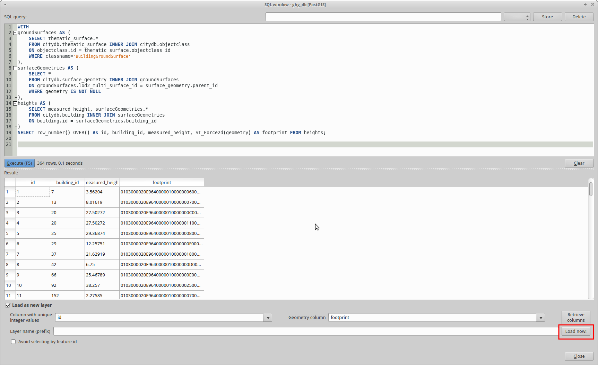
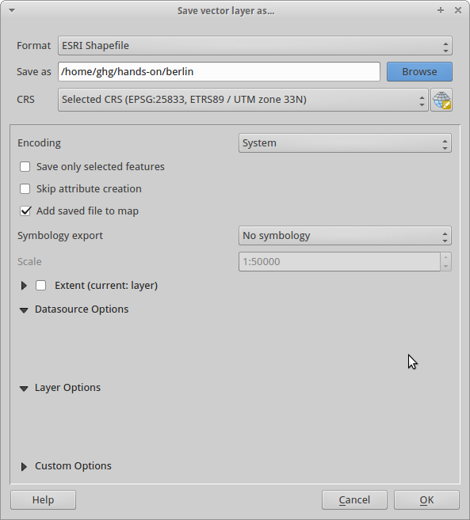

% CityGML - Applications, Open Data and Open Source Tools
% Richard Redweik & Stefan Lüdtke
% 22. - 23. November 2015

#
## Working with CityGML

## Recap 

Application independent geospatial information model

Different thematic areas (buildings, water, vegetation, bridges etc.)
International OGC standard
**Data model (UML)** and **exchange format** (based on GML3)
CityGML represents

- 3D geometrey, 3D topology, semantics, and appearance
- in 5 discrete scales (levels of detail, LOD)

**However!**

CityGML datasets may become very large --&gt; Use database to work with!

## Need for database? some examples

* multiple simultaneous changes to data (concurrency)
* data changes on a regular basis
* large data sets where you only need some observations/ variables
* share huge data set among many people (data consistency in a working groug!)
* rapid queries
* web interfaces to data, especially dynamic data
* data bases are collections of tables (2d with columns and rows)
* very good for combining information from several tables

# 
## Agenda

- 3D City Database
- 3D City Database Importer/Exporter
- QGIS

# 
## 3DCityDB-Overview

](./pictures/3DCityDB_System.png)


#
## 3DCityDB-Details

Free 3D geo database

Enables to store, represent, and manage virtual 3D city models

Realized as relational database schema for:

- **PostgreSQL/PostGIS**
- Oracle Spatial

#
## PostgreSQL


* Relational Database Management System (RDBMS)

* **Open Source**

* Strong reputation for **reliability**, **data integrity** and
**correctness**

* Very good documentation

* Runs on Linux, Unix (MacOS, BSD), Windows

* pgAdmin as GUI for administration

## PostgreSQL and PostGIS


* PostgreSQL is a powerful, _open source_ object-relational database system
* \> 15 years of active development and a proven architecture 
* runs on all major operating systems, including Linux, UNIX (AIX, BSD, HP-UX, SGI IRIX, Mac OS X, Solaris, Tru64), and Windows
* It includes most SQL:2008 data types, including INTEGER, NUMERIC, BOOLEAN, CHAR, VARCHAR, DATE, INTERVAL, and TIMESTAMP
* It also supports storage of binary large objects, including pictures, sounds, or video
* diverse native programming interfaces (C/C++, Java, .Net, Perl, Python, ... )
* comprehensive documentation

## Key features


---------------------------------------------------------------
Limit                              Value
-------------------------  ------------------------------------
Database Size					   Unlimited

Maximum Table Size				   32 TB

Maximum Row Size				   1.6 TB 

Maximum Field Size				   1 GB 

Maximum Rows per Table			   Unlimited

Maximum Columns per Table		   250 - 1600 depending on column types 

Maximum Indexes per Table		   Unlimited 

---------------------------------------------------------------

## Architecture

* The library (frontend) sends user requests over the network to the postmaster. 
* Postmaster starts a new backend server process and connects the frontend process to the new server. 
* Frontend process and the backend server communicate without intervention by the postmaster. 
* the postmaster and the backend always run on the same machine (the database server), 
while the frontend application may run anywhere. 
* data base server can contain many databases
* PostgreSQL uses a message-based protocol for communication between frontends and backends (clients and servers)
* The protocol is supported over TCP/IP 

##


## SQL

* Structured Query Language
* ... is a computer language to save, edit and query data in relational data bases
* first version in 1974 (IBM) 
* SQL became a standard of the American National Standards Institute (ANSI) in 1986
* revised in 1999: SQL99 or SQL3
* SQL has standards but also some pecularities depending on the database management system
* 'Talk' to the database server
* used as front end for postgresql
* case sensitive (usually upper case for keywords)

## ways to use SQL

* console command (psql -h hostaddress -U  db_name)

* GUI (pgadmin)

* interfaces to programming languages (R, python, PHP, etc.)

## SQL syntax-I

* create database

```sql
CREATE TABLE measurements(id BIGINT NOT NULL DEFAULT, date TIMESTAMP WITH TIME ZONE, value DOUBLE PRECISION);
```

* save data

```sql
INSERT INTO mesuremetns VALUES('2014-09-01', 10.456);
```

* edit data

```sql
UPDATE measurements SET value = value + 1;
```

## SQL syntax-II

* query data

```sql
SELECT value FROM measurements;
```

* comparison

```sql
SELECT value FROM measurements WHERE date > '2013-01-01';
```

* summary and computations

```sql
SELECT MAX(value) AS max_val FROM measurements WHERE date > '2013-01-01'
```

#
## PostGIS

* Spatial extension for PostgreSQL

* Support for spatial objects (geometry, geography, raster)

* Spatial functions

* Multi-dimensional spatial indexing


## Additional data type for a geometry

The geometry is stored in a extra column, usually termed *geom* or *the_geom*, all based
the following [link](http://postgis.net/docs/manual-2.1/using_postgis_dbmanagement.html)
 
* uses Well-Known Binary (WKB) and Well-Known Text (WKT) Representations defined by *OGC*
* POINT (0 0)
* LINESTRING (0 0,1 1,1 2)
* POLYGON ((0 0,4 0,4 4,0 4,0 0),(1 1, 2 1, 2 2, 1 2,1 1))
* MULTIPOINT ((0 0),(1 2))
* MULTILINESTRING ((0 0,1 1,1 2),(2 3,3 2,5 4))


## PostGIS provides 

* Processing and analytic functions for both vector and raster data for splicing, dicing, morphing, reclassifying, and collecting/unioning with the power of SQL
* raster map algebra for fine-grained raster processing
* Spatial reprojection SQL callable functions for both vector and raster data
* Support for importing / exporting ESRI shapefile vector data via both commandline and GUI packaged tools and support for more formats via other 3rd-party Open Source tools
* Packaged command-line for importing raster data from many standard formats: GeoTiff, NetCDF, PNG, JPG to name a few
* Rendering and importing vector data support functions for standard textual formats such as KML,GML, GeoJSON,GeoHash and WKT using SQL 
* Rendering raster data in various standard formats GeoTIFF, PNG, JPG, NetCDF, to name a few using SQL
* Seamless raster/vector SQL callable functions for extrusion of pixel values by geometric region, running stats by region, clipping rasters by a geometry, and vectorizing rasters
* 3D object support, spatial index, and functions
* Network Topology support

## PostGIS functions

**the PostGIS extension offers *full* GIS functionality ...**

* reprojection
* area calculations 
* intersect, union, merge ... 

\
\


**... among all data-types**

* all vector types supported (point, line, area ...)
* raster layers supported as well

\
\


**and standard interfaces for visualization**

* QGIS, GRASS spatial layers from a Postgres DB out of the box
* ArcMap is supposed to do so as well


## ST\_() Functions

A bunch of ST\_() Functions are available to work with the *geom* column

* getting the CRS of the table/layer

```sql
SELECT ST_SRID(geom) from catchments;
```

* re-project a column into a different CRS 

```sql
UPDATE subbasins SET geom = ST_TRANSFORM(geom, 4326);
```

## PostGIS - Example

```sql
SELECT name, pop FROM cities 
WHERE pop < 300000  
AND ST_Area(cities.the_geom) < 400000000;
```

#
## 3D City Database Importer/Exporter

Front-end for 3D city database

Allows importing and exporting of CityGML data into/from 3DCityDB

Allows export in KML and COLLADA for visualization

Offers GUI and CLI

# 
## 3DCityDB-Overview

](./pictures/3DCityDB_System.png)

# 
## QGIS

Previously known as *Quantum GIS*

Open source Geographic Information System (GIS)

Integration of **PostGIS** and GRASS

Runs on Linux, Unix, MacOS, Windows, Android

Supports many vector, raster, and database formats and functionalities

Customizable via plugins (C++, Python)

# 
## 3D City Model Berlin

550.000 buildings on about 890 sqkm

LOD2 building models with facade textures

Can be downloaded and used as part of Berlin's Open Data Initiative

Berlin 3D - [Download Portal](http://www.businesslocationcenter.de/en/downloadportal)

#
## Data modelling

is **fundamental** for efficient 

* storage of data
* data maintenance
* work with data

## Database normalisation

Normalisation is the formalisation of the design process of making a database compliant with the concept of a Normal Form. 

It addresses various ways in which we may look for repeating data values in a table.

There are several levels of the Normal Form, and each level requires that the previous level be satisfied.

The normalization process is based on collecting an exhaustive list of all data items to be maintained in the database and 
starting the design with a few "superset" tables. 

## Normalisation- First Normal Form

For best results, start with a reasonable breakdown of all attributes in different tables

Reduce entities to first normal form (1NF) by removing repeating or multivalued attributes to another, child entity.

Basically, make sure that the data is represented as a (proper) table. 

While key to the relational principles, this is somewhat a motherhood statement. 

## Normalisation- First Normal Form

However, there are six properties of a relational table (the formal name for "table" is "relation"):

1. Entries in columns are single-valued.
2. Entries in columns are of the same kind.
3. Each row is unique.
4. Sequence of columns is insignificant.
5. Sequence of rows is insignificant.
6. Each column has a unique name.

\

The most common sins against the first normal form (1NF) are the lack of a Primary Key and the use of "repeating columns." 

## Normalisation- Second Normal Form

Reduce first normal form entities to second normal form (2NF) by removing attributes that are not dependent on the whole primary key.

The purpose here is to make sure that each column is defined in the correct table. Using the more formal names may make this a little clearer. Make sure each attribute is kept with the entity that it describes. 

## Normalisation- Third Normal Form

Reduce second normal form entities to third normal form (3NF) by removing attributes that depend on other, non-key attributes (other than alternative keys).

This basically means that we shouldn't store any data that can either be derived from other columns or belong in another table

\

\

* for more background and guidance 
[code guru](http://www.codeguru.com/csharp/.net/net_data/article.php/c19615/Introduction-to-Relational-Databases--Part-1-Theoretical-Foundation.htm)

#
## Hands-On

Create Database

Create 3D City Database

Import City Model

Inspect Database with pgAdmin

Export building data with QGIS

# 
## Create Database

Execute following statement as PostgreSQL admin:
```sql
CREATE DATABASE ghg_handson
WITH OWNER = ghg;
```
... and to enable PostGIS:

```sql
CREATE EXTENSION postgis;
```
It is already done on the VM! \\o/

#
## Create 3D City Database (3DCityDB)

The 3DCityDB is a relational database schema

Schema results from a mapping of the object-oriented data model of CityGML to the relational data model of the RDBMS

Schema is like a 'blueprint' of the database

To create the schema with its tables execute:

```bash
cd /home/ghg/Documents/3DCityDB-3.0.0-postgis/PostgreSQL/SQLScripts/
psql ghg_handson -f CREATE_DB.sql
```

## 

Setup requires user input:

1. Spatial Reference Identifier for geometry objects (SRID):

**25833**

2. GML conformant URN encoding for gml:srsName attributes:

**urn:ogc:def:crs,crs:EPSG::25833,crs:EPSG::5783**

#
## Import City Model

Start 3D City Database Importer/Exporter  

## Connect to Database


## Do the import


# Play around with pgAdmin

#
## Export data with QGIS

## Start QGIS 

1. Open QGIS Desktop

2. Add new database:
	
     1. Click on the PostGIS logo (Elephant)

     2. Select 'New'

## Add New Database


## Query Buildings from DB 

Open 'Database' > 'DB Manager' > 'DB Manager'

Select database 'ghg_handson' and open 'SQL window'


## Query Buildings from DB (cont.)
Execute following query:

```sql
WITH
groundSurfaces AS (
	SELECT thematic_surface.* 
	FROM citydb.thematic_surface INNER JOIN citydb.objectclass 
	ON objectclass.id = thematic_surface.objectclass_id 
	WHERE classname='BuildingGroundSurface'
),
surfaceGeometries AS (
	SELECT *
	FROM citydb.surface_geometry INNER JOIN groundSurfaces
	ON groundSurfaces.lod2_multi_surface_id = surface_geometry.parent_id
	WHERE geometry IS NOT NULL
),
heights AS (
	SELECT measured_height, surfaceGeometries.*
	FROM citydb.building INNER JOIN surfaceGeometries
	ON building.id = surfaceGeometries.building_id
)
SELECT row_number() OVER() As id, building_id, 
measured_height, ST_Force2d(geometry) AS footprint FROM heights;
```

## Query Buildings from DB (cont.)

Select 'Load as new layer'

'Column with unique integer values' : 'id'

'Geometry column' : 'footprint'

## Query Buildings from DB (cont.)



## Buildings with Attributes


## Buildings with Attributes

Example building:


## Export to Shape I


Do a right-click onto the layer:


## Export to Shape II

